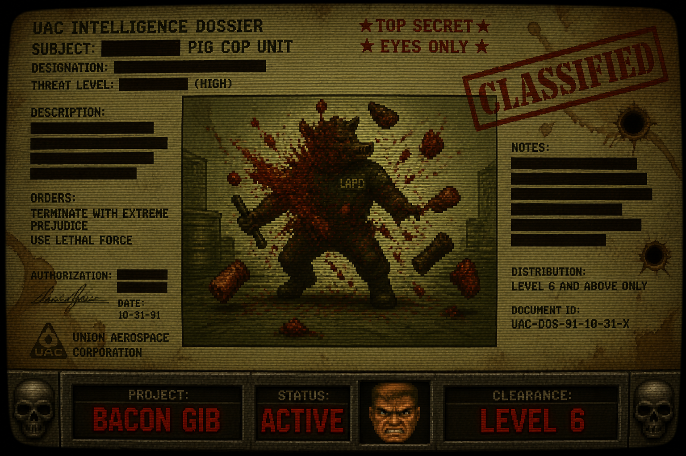

  

---

**⚠ CLEARANCE LEVEL 6 REQUIRED ⚠**

*This document contains materials related to an ongoing extraction protocol.*
*Unauthorized access will result in immediate gibbing.*

---

## SITUATION REPORT

An operative discovered that certain... *subjects*... were not receiving the treatment they deserved within existing tactical frameworks. Standard protocols lacked the visceral feedback required for proper field operations.

This project rectifies that oversight.

## OPERATIONAL STATUS
PHASE 1: ASSEMBLE ████████░░ 80%
└── Wire existing assets into gore framework
└── Establish target subject: [REDACTED — PORCINE UNIT]
└── Validate extraction on single target
PHASE 2: ADAPT ░░░░░░░░░░ PENDING
└── Tune behavioral response systems
└── Environment interactivity
└── Vocal feedback loop: [CLASSIFIED]
PHASE 3: GENERATE ░░░░░░░░░░ LOCKED
└── Autonomous asset creation
└── Novel target variants
└── Self-patching deployment loop
## TECHNICAL SPECIFICATIONS
ENGINE:         [REDACTED] — open source, community-maintained
FORMAT:         pk3 container
SCRIPTING:      ZScript / DECORATE
PIPELINE:       monitor → reason → patch → repack → eval → repeat
FIRST TARGET:   One subject. One protocol. Proof of concept.
## KNOWN ASSOCIATES

This operation builds upon the work of several prior field teams whose contributions are acknowledged under operational cover:

- `CODENAME: BRUTALIST` — *Original architect of the visceral feedback framework*
- `CODENAME: LIBERATOR` — *Provided the open asset foundation*
- `CODENAME: DARKENGINE` — *Runtime environment and toolchain*
- `CODENAME: ALPHA-DUKE` — *Prior attempt at subject-specific adaptation, ceased operations*

*Their service is not forgotten.*

## RULES OF ENGAGEMENT

1. This is a mod. For a game. About fictional scenarios.
2. All assets are original or sourced from open-license projects.
3. No commercial use. No stolen assets. No IP violations.
4. Contributions welcome — submit field reports via PR.

## INTEL FEED
[██████████] SIGNAL INTERCEPT
DATE:    2026.05.25
STATUS:  Assembling loadout
NEXT:    First subject extraction test
NOTE:    "Squeal for me." — [OPERATOR CALLSIGN REDACTED]
---

*"Some things deserve to be torn apart beautifully."*

`// 0x47 0x49 0x42`

